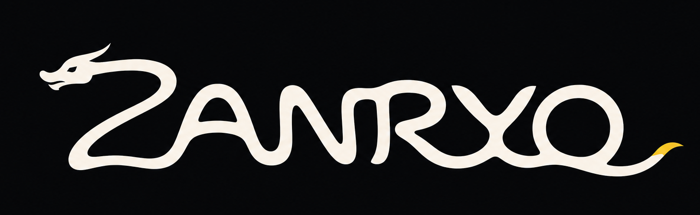

<p align="center">
  
</p>

<h1 align="center">Zanryo</h1>

<p align="center">
  <strong>Know what remains. Know how long it lasts.</strong>
</p>

<p align="center">
  A lightweight, local-first Codex quota monitor for macOS and the command line.
</p>

<p align="center">
  <code>macOS first</code>
  &nbsp;·&nbsp;
  <code>Rust core</code>
  &nbsp;·&nbsp;
  <code>Local history</code>
  &nbsp;·&nbsp;
  <code>MIT</code>
</p>

## What is Zanryo?

Zanryo is an open source menu-bar utility that tracks your Codex allowance, records how it changes over time, and estimates whether your current pace will last until the next reset.

Most quota indicators answer one question: how much is left?

Zanryo is designed to answer the next questions too:

- When does the limit reset?
- How quickly is it falling?
- Is the current pace sustainable?
- When is it likely to run out?
- How confident is that estimate?

The name comes from the Japanese word **残量**, pronounced *zanryō*, meaning remaining or residual quantity.

## Planned experience

The macOS menu bar stays intentionally quiet:

```text
Zanryo 15% · 5d 3h
```

Open the native popover for the full picture:

- weekly Codex allowance and reset;
- Spark allowance as a secondary metric;
- current-cycle history;
- consumption rate per day;
- sustainable pace until reset;
- estimated depletion time;
- uncertainty when enough history exists;
- optional actual OpenAI API spend.

The interface is English, compact, keyboard accessible, and designed to update without becoming another heavy background application.

## Forecast, not guesswork

Zanryo stores local samples and combines recent activity with the pace of the current reset cycle.

The chart distinguishes:

- observed usage;
- estimated future usage;
- sustainable budget;
- reset boundaries;
- insufficient history.

Forecasts are always presented as estimates. When there is not enough data, Zanryo says so instead of inventing certainty.

## Lightweight by design

The initial performance targets are:

| Metric | Target |
|---|---:|
| Idle CPU | Below 0.5% |
| App and helper memory | Below 75 MB |
| Detailed local history | About 90 days |
| Active refresh | Every 15 seconds |
| Idle refresh | Every 60 seconds |

Official Codex events are applied immediately when available. Popup open, manual refresh, and system wake also trigger a refresh. Only one refresh runs at a time.

## Architecture

```text
Codex app-server
        |
        v
Rust collector and normalized model
        |
        +---- SQLite history
        +---- Forecast engine
        +---- zanryo CLI
        |
        v
Native SwiftUI and AppKit macOS shell
```

The reusable Rust core owns collection, persistence, forecasting, and CLI behavior. The macOS shell owns native presentation, lifecycle integration, Keychain access, and start at login.

A GTK4 Linux shell is planned after the macOS implementation is validated.

## Commands

The planned CLI surface is small:

```console
zanryo
zanryo watch
zanryo history --days 7
zanryo doctor
zanryo --json
```

Installation instructions will be added when the first runnable build is available.

## Installation

The first public release will provide a signed and notarized macOS download.

Homebrew Cask is also planned:

```console
brew install --cask joaoluna/tap/zanryo
```

This command is not live yet. The README will be updated when the first release artifact and tap are available.

## Visual direction

The default palette uses:

| Role | Color |
|---|---|
| Background | `#0C0E10` |
| Surface | `#16191D` |
| Warm white | `#F8F3E8` |
| Weekly accent | `#F2B632` |

The yellow accent belongs to the weekly Codex limit. Spark remains neutral.

The primary wordmark is one continuous dragon forming the entire word **ZANRYO**. Its yellow tail tip represents the quantity that remains. The application icon uses the same dragon as a standalone Z.

The menu-bar item remains text only. Branding never competes with the number you opened Zanryo to read.

## Project status

Zanryo is currently in the design and implementation-planning stage.

- [x] Product scope
- [x] macOS interaction model
- [x] Rust-first architecture
- [x] Refresh strategy
- [x] Forecast behavior
- [x] Default theme
- [x] Name and visual identity
- [ ] Rust workspace and protocol fixtures
- [ ] Local history
- [ ] Forecast engine
- [ ] Native macOS application
- [ ] Packaging and first release
- [ ] Linux shell

The first macOS build will run alongside existing quota tools for several days. Replacement only happens after values, resets, refresh behavior, and resource usage are validated.

## Contributing

The foundation is still being planned. Issues, implementation guidance, and contribution instructions will be added once the initial workspace and test boundaries are in place.

Until then, the README reflects the public product direction and current scope.

## Privacy

Usage history stays on your machine.

Zanryo does not need cloud synchronization or product telemetry for its core features. Optional API spend requires an explicit read-only credential stored in macOS Keychain. Secrets are never written to history, logs, screenshots, or Git.

## License

Zanryo will be released under the MIT License.

## Disclaimer

Zanryo is an independent open source project. It is not affiliated with, endorsed by, or sponsored by OpenAI.
