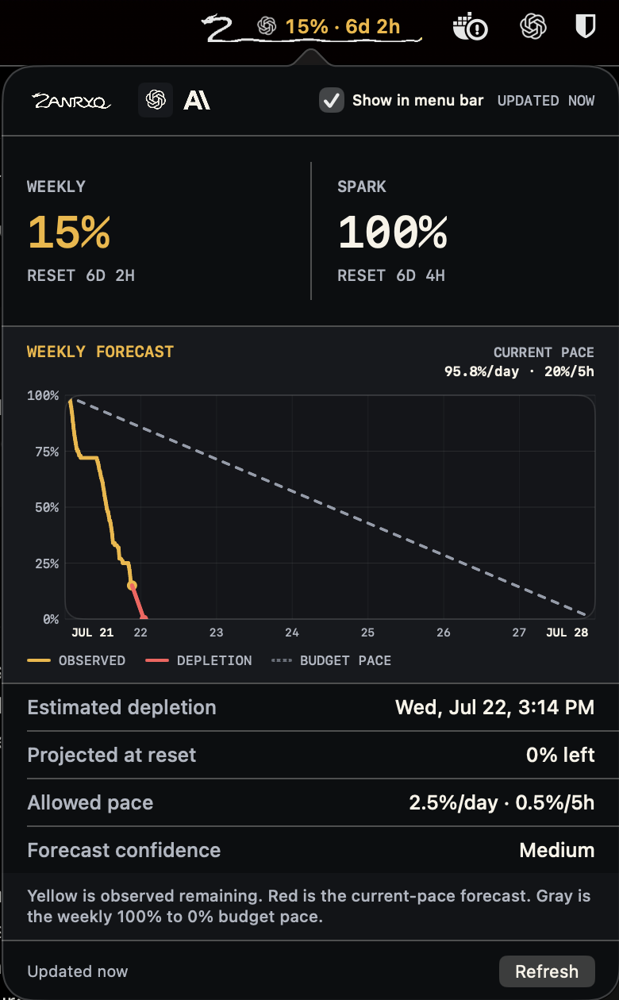

<p align="center">
  
</p>

<h1 align="center">Zanryo</h1>

<p align="center">
  <strong>Know what remains. Know how long it lasts.</strong>
</p>

<p align="center">
  A lightweight, local-first Codex quota monitor for macOS and the command line.
</p>

<p align="center">
  <code>macOS 14+</code>
  &nbsp;·&nbsp;
  <code>Rust core</code>
  &nbsp;·&nbsp;
  <code>Local history</code>
  &nbsp;·&nbsp;
  <code>MIT</code>
</p>

<p align="center">
  
</p>

> Zanryo is a working development preview. The macOS app and CLI currently build from source. Signed releases and official Homebrew packages are not available yet.

## What is Zanryo?

Zanryo tracks how much Codex quota remains, records the current cycle locally, and estimates whether your usage pace will last until the next reset.

Most quota indicators stop at a percentage. Zanryo also helps answer:

- When does the limit reset?
- How quickly is the remaining quota falling?
- What pace would keep it available until reset?
- When is it likely to run out at the current pace?
- How reliable is that estimate?

The name comes from the Japanese word **残量**, pronounced *zanryō*, meaning remaining or residual quantity.

## The current experience

The native macOS menu bar keeps the important information visible without opening a window:

- a compact dragon-Z and adaptive tail;
- the active provider symbol;
- remaining quota;
- time until reset.

Open the popover for the complete view:

- Weekly and Spark allowances with independent reset times;
- a full-cycle forecast from 100% at cycle start to reset;
- current usage pace per day and per five hours;
- estimated depletion time;
- projected quota remaining at reset;
- allowed pace and forecast confidence;
- authenticated Codex plan when the official app-server exposes it;
- manual refresh and provider visibility controls.

OpenAI is the first provider. Claude subscription quotas can be read through the installed Claude Code CLI's native `/usage` command, in safe mode without a model request. Each provider and reset window stays separate. Missing data is shown as unavailable, never invented or displayed as zero.

Claude collection currently supports the observed CLI **2.1.282** screen format. Sign in and approve folder trust in Claude Code yourself, then select that folder with **Trusted folder…** in Zanryo. Zanryo never approves login, trust, or permission prompts. It waits for the usage refresh to complete rather than accepting the CLI's initial cached frame. Background refresh is limited to once per five minutes, with **Refresh now** available; failures retain the last saved reading and mark it stale. Reset times have the minute precision displayed by the CLI. No OAuth tokens, browser cookies, private endpoints, or account identifiers are collected.

Freshness is inferred from the supported CLI's refresh transition and completed display, not a server timestamp or an independent API receipt. An unrecognized CLI error or future screen change can require a collector update. Claude collection currently requires Unix terminal support; it fails closed on other platforms.

## Reading the forecast

Every visible quota uses **remaining**, from **100% available to 0% exhausted**.
Providers and windows stay independent; quotas are never summed. A source that
reports used quota is converted once at collection (`remaining = 100 - used`).
The SQLite/JSON `remaining_percent` contract is unchanged. Missing data stays
unavailable, never a fabricated zero.

The chart uses three clear lines:

- **Yellow, Observed:** recorded quota remaining during the current cycle.
- **Red, Depletion:** the current-pace projection from the latest observation.
- **Gray, Budget pace:** a linear reference from 100% at cycle start to 0% at reset.

Forecasts are estimates. Zanryo reports low, medium, or high confidence according to the available history and avoids presenting certainty when the data does not support it.

## Local and lightweight

Zanryo uses the authenticated local Codex app-server and stores quota samples in SQLite on your machine. The app renders cached data immediately, refreshes at launch, when the popover opens, on demand, and every 60 seconds while running.

There is no Zanryo account, cloud synchronization, or product telemetry. Codex credentials are neither requested nor stored.

## Installation

### macOS app from source

The current shell targets Apple silicon and macOS 14 or newer. Install Xcode, [Rust through rustup](https://rustup.rs/), and XcodeGen, then run:

```console
git clone https://github.com/jaoluna/zanryo.git
cd zanryo
brew bundle
xcodegen generate --spec apps/zanryo-macos/project.yml
xcodebuild \
  -project apps/zanryo-macos/Zanryo.xcodeproj \
  -scheme Zanryo \
  -configuration Release \
  -destination 'platform=macOS,arch=arm64' \
  -derivedDataPath /tmp/zanryo-build \
  build
open /tmp/zanryo-build/Build/Products/Release/Zanryo.app
```

### CLI from source

```console
cargo install --path apps/zanryo-cli
zanryo
```

Useful commands:

```console
zanryo --json
zanryo watch
zanryo history --days 7
zanryo doctor
```

### Homebrew roadmap

The intended official commands are:

```console
brew install zanryo
brew install --cask zanryo
```

These commands are **not live yet**. The first will install the CLI. The second will install the signed and notarized macOS app with its bundled CLI. Until the packages are accepted into the official Homebrew repositories, build from source and watch GitHub Releases for the first public artifact.

## Architecture

```text
Codex app-server
        |
        v
Rust collector and normalized model
        |
        +---- SQLite history
        +---- Forecast engine
        +---- zanryo CLI
        |
        v
Native AppKit and SwiftUI macOS shell
```

The Rust core owns collection, provider-aware models, persistence, forecasting, and CLI behavior. The macOS shell owns native presentation and menu-bar lifecycle through a narrow C ABI with immutable JSON envelopes.

## Development

Rust stable, `rustfmt`, and Clippy are pinned through `rust-toolchain.toml`.

```console
cargo fmt --all --check
cargo clippy --workspace --all-targets --all-features -- -D warnings
cargo test --workspace
```

Generate the local Xcode project whenever `project.yml` changes:

```console
xcodegen generate --spec apps/zanryo-macos/project.yml
```

## Project status

- [x] Rust core and CLI
- [x] Local SQLite history
- [x] Pace and depletion forecast engine
- [x] Native macOS menu-bar application
- [x] Dragon identity and provider-aware status layout
- [x] OpenAI Codex quota collection
- [x] Guarded Claude CLI quota collector (supported native screen format; no public release yet)
- [ ] Signed and notarized macOS release
- [ ] Official Homebrew Formula and Cask
- [ ] Linux desktop shell

## Contributing

Issues and focused pull requests are welcome. Please keep the core local-first, preserve honest unavailable states, and add tests for behavior changes.

## Privacy

Usage history stays on your machine. Secrets and account identifiers are not written to history, logs, screenshots, or Git.

## License

Zanryo is available under the [MIT License](LICENSE).

## Disclaimer

Zanryo is an independent open source project. It is not affiliated with, endorsed by, or sponsored by OpenAI or Anthropic.
